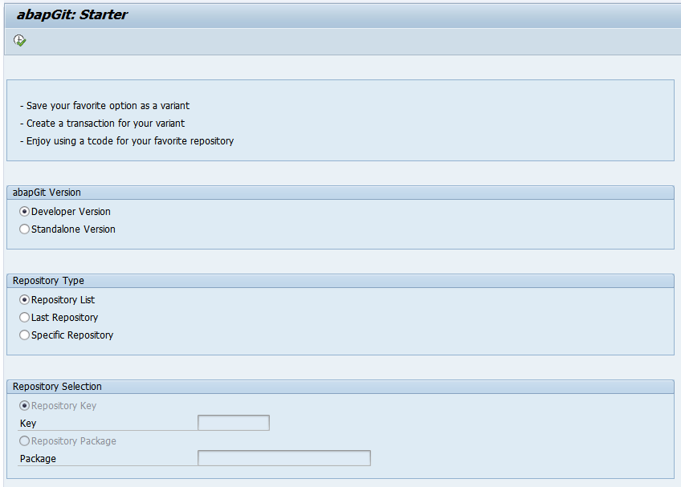
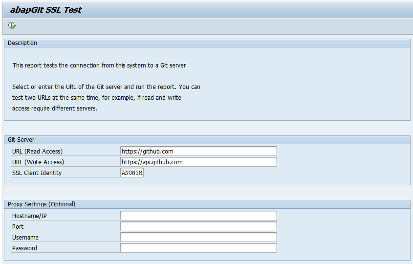
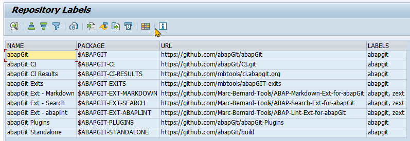
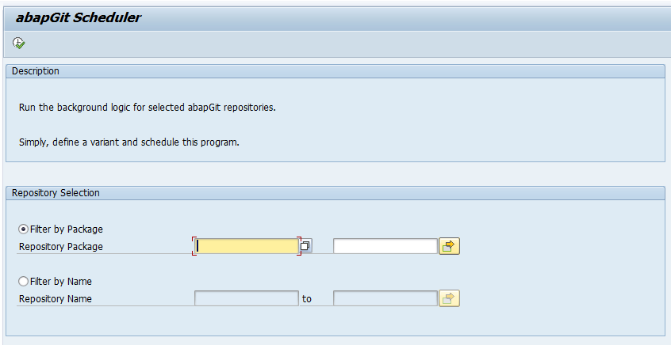
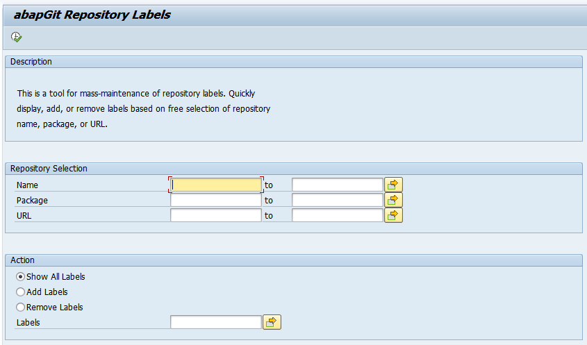

# Tools for abapGit

This is a collection of little helpers and painkillers for abapGit. Enjoy! :grin:

Made by [Marc Bernard Tools](https://marcbernardtools.com/) giving back to the [SAP Community](https://community.sap.com/)

NO WARRANTIES, [MIT License](LICENSE)

## The Tools

### abapGit Starter

The starter is a simple program that lets you define variants for running abapGit. You can pick between the developer or standalone version and starting up with the repository list, the last repository, or a specific repository based on a repository key or SAP package.

### abapGit Repository Labels

A tool for doing mass maintenance of repository labels. Quickly display, add, or remove labels based on a free selection of repository names, packages, or URLs.

### abapGit Scheduler

A tool that lets you run the background logic for selected abapGit repositories.

### abapGit SSL Test

For convenience, the repository contains the SSL test tool found in the abapGit [documentation](https://docs.abapgit.org/guide-ssl-test.html).

## Prerequisites

- SAP Basis 7.02 or higher
- Installation of developer and standalone version of abapGit

## Installation

You can install the tools using [abapGit](https://github.com/abapGit/abapGit) either by creating a new online repository for https://github.com/Marc-Bernard-Tools/ABAP-Tools-for-abapGit or downloading the repository [ZIP file](https://github.com/Marc-Bernard-Tools/ABAP-Tools-for-abapGit/archive/main.zip) and creating a new offline repository.

Recommend SAP package: `$ABAPGIT-TOOLS`.

## Contributions

All contributions are welcome! Read our [Contribution Guidelines](CONTRIBUTING.md), fork this repo, and create a pull request.

## About

Made with :heart: in Canada

Copyright 2023 Marc Bernard <https://marcbernardtools.com/>

Follow [@marcfbe](https://twitter.com/marcfbe) on Twitter

